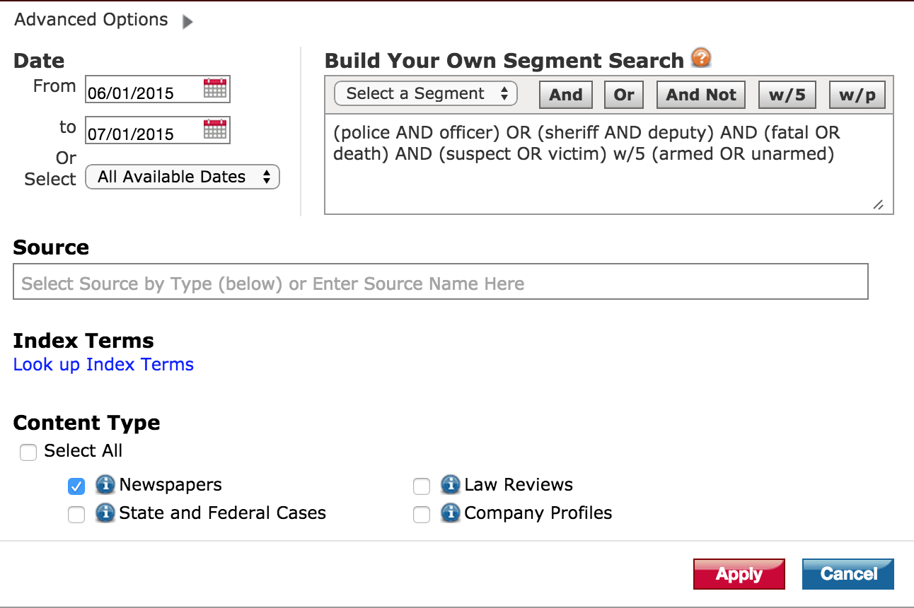

# Deadly Force DB Lessons 

This (likely temporary) repo contains notes and documents and links specific to how Deadly Force DB fits in Stanford Journalism curriculum and lesson goals.

## Tools

This project will be heavily-focused on plaintext systems and spreadsheets (preferably, Google Sheets), with some *nix command-line tools thrown in for good measure. Students will be introduced to regular expressions, or rather, thinking of how to _search by patterns_. 

With [Lexis-Nexis Academic](https://lib.stanford.edu/lexis-nexis-academic), we have access to an overwhelmingly number of news articles. While LN does not allow scraping, it _does_ allow for bulk downloads of up to 500 articles in a variety of formats, including plain text, Word documents, and HTML. One intended goal for this course is that students realize the power and flexibility of plain-text and its tool ecosystem.

- [The Silver Searcher](http://geoff.greer.fm/2011/12/27/the-silver-searcher-better-than-ack/) - built for speedy code searching, I like it because it is basically grep except with [PCRE support](http://www.pcre.org/)
- [Sublime Text 3](http://www.sublimetext.com/3) - Great for working with plain text and providing an interactive searching interface.
- [Atom](https://atom.io/) - I've installed this but haven't used it much. Seems to be a strong and growing alternative to ST3.
- [Visual Studio Code](https://code.visualstudio.com/Download) - I also haven't tried this extensively but this free code editor [from Microsoft gets rave reviews even in its early stages](http://benfrain.com/microsoft-code-a-mini-review-after-7-days-use/). 

Side note: Lexis Nexis has its own mini-syntax used to do advanced searches, such as [logical operators and wildcards](http://help.lexisnexis.com/litigation/ac/law/law6.6/full_text_searching.htm):

e.g.

    (police AND officer) OR (sheriff AND deputy) AND (fatal OR death) AND (suspect OR victim) w/5 (armed OR unarmed)

## Readings

### Civic Affairs

#### [In Baltimore, No One Left to Press the Police](http://davidsimon.com/in-baltimore-no-one-left-to-press-the-police/), David Simon

> David Simon laments the state of journalism and reiterates the importance of continual vigilance in shaping how government responds to citizen oversight:

 In an American city, a police officer with the authority to take human life can now do so in the shadows, while his higher-ups can claim that this is necessary not to avoid public accountability, but to mitigate against a nonexistent wave of threats. And the last remaining daily newspaper in town no longer has the manpower, the expertise or the institutional memory to challenge any of it.

> At one point last week, after the department spokesman denied me the face sheet of the shooting report, I tried doing what I used to do: I went to the Southeastern District and demanded the copy on file there.

> When the desk officer refused to give it to me, I tried calling the chief judge of the District Court. But Sweeney’s replacement no longer handles such business. It’s been a while since any reporter asked, apparently. So I tried to explain the Maryland statutes to the shift commander, but so long had it been since a reporter had demanded a public document that he stared at me as if I were an emissary from some lost and utterly alien world.

> Which is, sadly enough, exactly true.

### Methodology

#### [Is Google More Accurate Than the FBI?](https://www.themarshallproject.org/2015/07/02/is-google-more-accurate-than-the-fbi), Marshall Project

A nice overview of all the different initiatives and strategies in counting officer-involved homicides.

- Differences in counting
  + > The Washington Post and the Guardian have developed their own methods for counting police-involved deaths in part because no other organization has precise tallies.
  + WaPo:    
    > But other people are absent, like Freddie Gray, who died of injuries sustained while handcuffed and shackled in a police van. His name is not in the database because the Washington Post tracks only shooting deaths involving on-duty officers.
  + Guardian:    
    > But because they count all police-involved deaths — not just shootings — their total is higher.  

  + FBI: 
    > The FBI, for its part, requests that law-enforcement agencies submit a count of police-involved deaths as part of its Uniform Crime Reports (UCR)...The FBI aggregates these counts and publishes estimates of justifiable homicides by police officers in its Supplementary Homicide Report. But the numbers are widely seen as incomplete because law-enforcement agencies contribute to the report voluntarily. Only about 2,700 out of 22,000 agencies recognized by the FBI contributed counts in 2013

  + CDC:
    > The Center for Disease Control and Prevention also tracks deaths due to “legal intervention.” Through the National Violent Death Reporting System, it aggregates information from state authorities on a voluntary basis. Currently only 32 states participate in the program

- The use of Google News:
  + > The Guardian and the Washington Post both rely heavily on two websites, Fatal Encounters and Killed by Police, in compiling their databases. In turn, both Fatal Encounters and Killed by Police rely on something commonly thought of as a vanity tool — Google Alerts — which allow people to set up custom searches and receive email alerts when those searches return new findings.

--------------

## Databases

This is only relevant for the Stanford community, as they are databases provided through the Stanford academic libraries [TODO: this is just a temporary place for me to take notes, will move this to a different page]. 

- [Lexis-Nexis Academic](https://lib.stanford.edu/lexis-nexis-academic)
- [Factiva through the GSB](http://searchworks.stanford.edu/view/9264178), [direct GSB link](http://www.gsb.stanford.edu/library/articles/databases/links/factiva.html)
- [NewsBank](http://searchworks.stanford.edu/view/8159714)
- How [to connect off-campus](https://library.stanford.edu/using/connect-campus/ezproxy-alternative-campus-access)
