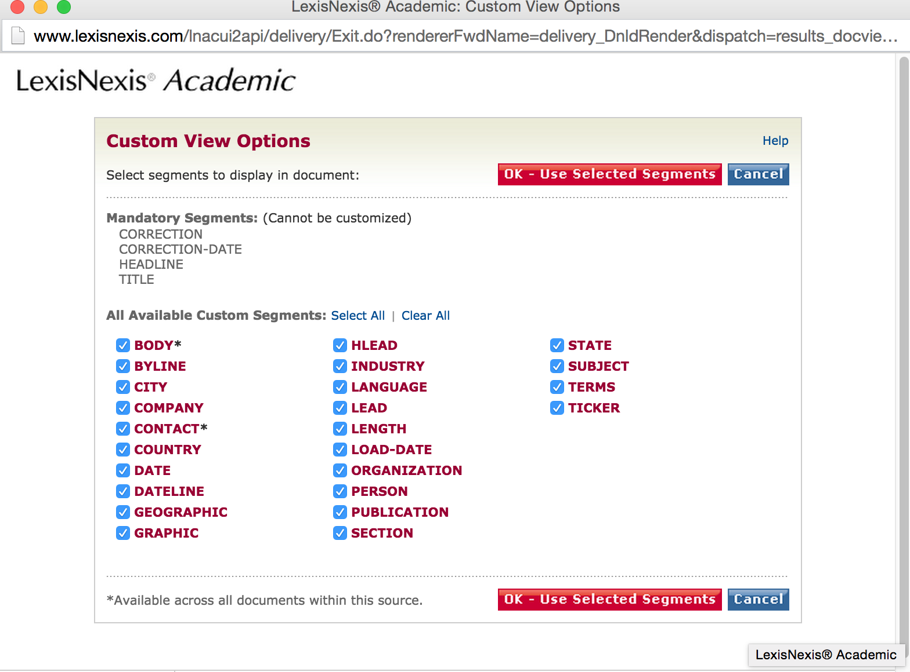
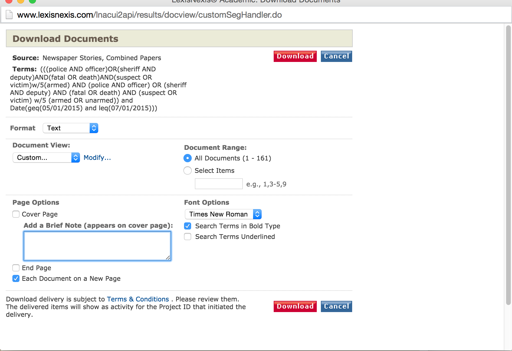
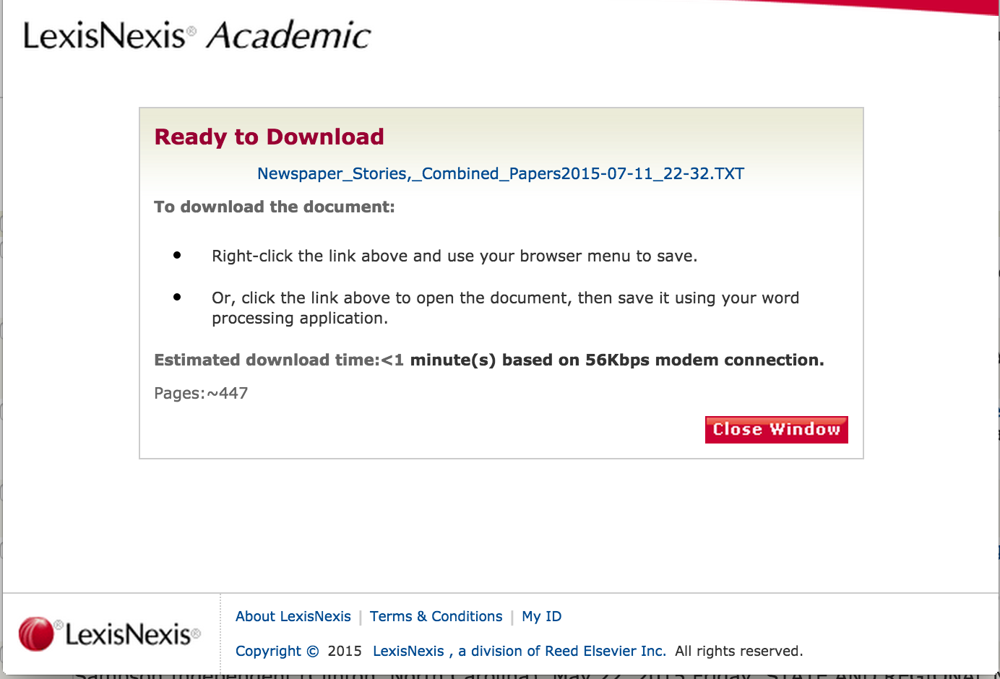

# Using Lexis-Nexis

Some instructions on how to use Lexis-Nexis

### Exporting

#### Choosing segments

#### Choosing format

#### Download link

## Sample output

- [.DOC](files/data/lexis-nexis/Newspaper_Stories,_Combined_Papers2015-07-11.DOC)
- [.HTML](files/data/lexis-nexis/Newspaper_Stories,_Combined_Papers2015-07-11.HTML)
- [.PDF](files/data/lexis-nexis/Newspaper_Stories,_Combined_Papers2015-07-11.PDF)
- [.RTF](files/data/lexis-nexis/Newspaper_Stories,_Combined_Papers2015-07-11.RTF)
- [.TXT](files/data/lexis-nexis/Newspaper_Stories,_Combined_Papers2015-07-11.TXT)
